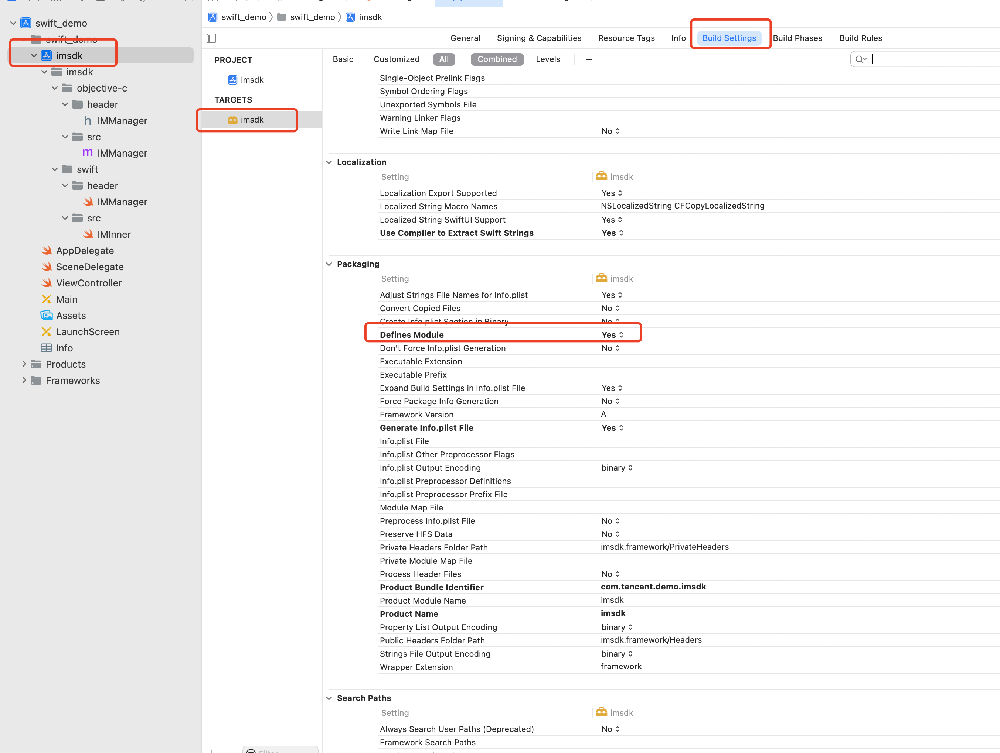
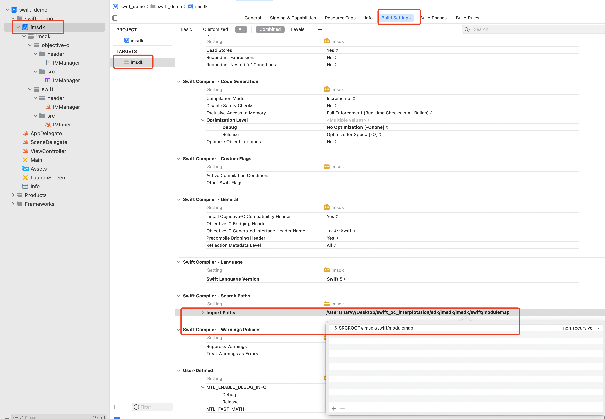
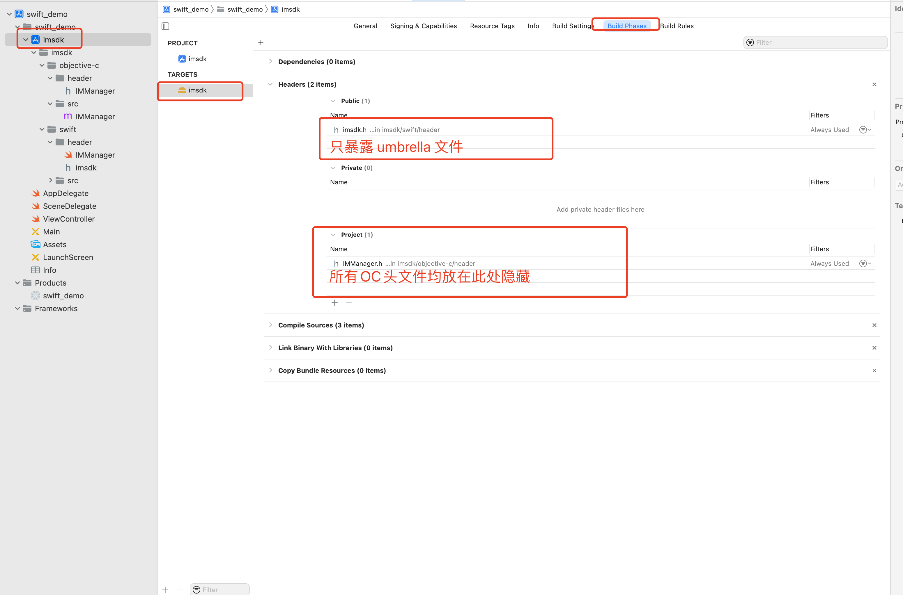
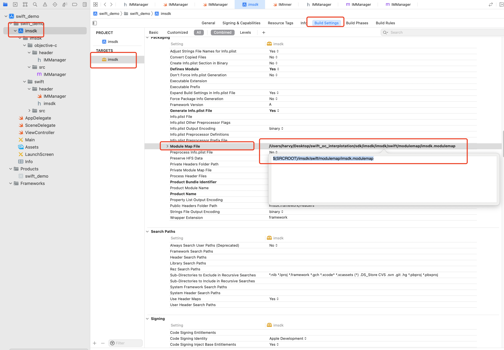

## 前言

我们团队是做即时通信类 SDK 的开发，提供了聊天、会话、群组、关系链等基础的 IM 功能。

SDK 采用跨平台开发技术，所有业务逻辑均采用 C++ 开发，各个平台均只提供接口封装，以保持逻辑一致性，目前 SDK 提供了 Objective-C、Java、C++ 以及跨平台 C 接口。

众所周知，Apple 大力推行 Swift 开发语言，目前海外市场大多数同类型厂商均提供了纯 Swift 的接口。由于国内市场的惯性，针对 iOS 平台，我们提供的是 Objective-C 的接口。

于是，整个 Swift 的适配就有了 2 大类解决方案：

* Objective-C 使用 Nonnull、Nullable、NS_SWIFT_NAME 来适配 Swift 的语法，借助 XCode 及桥接文件自动适配 Swift；
* 在现有 SDK 的基础上提供一套完整的纯 Swift 接口的 framework。

细心的读者一眼就可以看出，第一种解决方案等同于什么都不做，而是将 Swift 和 Objective-C 工程混编交给了客户，让其在业务层处理无法预见的工程混编问题。这种方案显得不专业，不符合 SDK 简单接入的初衷。XCode 将 Objective-C 导入到 Swift 后，会自动生成 Swift 语法，从而引起接口名称、枚举值等的混乱，影响了各平台 API 一致性。 

由于我们的业务逻辑均是通过 C++ 开发，那么是不是可以意味着直接在上层使用 Swift 封装即可？

结论是不可以。目前 Swift 仅支持 C 语言和 Objective-C，目前 对 C++ 的支持还处于开发阶段，还未正式对外发布，可 [查阅官网查看详情](https://www.swift.org/cxx-interop-workgroup/)。于是就有了下面 2 大类解决方案：

* 将目前的 C++ 业务代码使用 C 做一层跨平台的接口封装，提供给 Swift 使用；
* 使用 Objective-C 对 C++ 业务代码做一层接口封装，提供给 Swift 使用。

由于目前 SDK 本身就支持 C 和 Objective-C 接口，所以上面两种方案本身均是可行的。但因为跨平台 C 语言跟 Swift 之间混编涉及到数据结构的转换，以及缺少一些列的基础组件支持，相当于完全从零开始，工作量相比 Objective-C 来看会大很多。

综上原因，我们的 Swift 版本 SDK 基于现有 Objective-C 进行封装，下面将围绕这一主题展开。


## 1 Framework 混编方案

基于 Objective-C 接口封装，实际上有两个方案：

* 方案一：快速封装，定义 Swift 类继承自 Objective-C 类，直接暴露给业务层使用即可；
* 方案二：完全封装，Swift 层根据 Objective-C 的类结构完全重新定义，把 Objective-C 的细节屏蔽。

但需要注意的是，本次 SDK Swift 化，有两个需要重点解决的问题：

* 由于我们需要提供一套全新的 Swift 接口的 SDK（framework），于是就需要我们将 Objective-C 的细节隐藏；
* 各个平台 API 要一致，也就是说 Swfit 和 Objective-C 的类名、API 名需要相同，于是就需要我们解决命名冲突的问题。

考虑到上面两个问题，方案一直接继承 Objective-C 的类，会将 Objective-C 的细节暴露；即便是不暴露，Swift 化后的 API 头文件跳转时看不到类的属性定义。最终我们选择方案二。

实际上针对方案二，需要解决下面三个问题：

* Swift 在 framework 中引入 Objective-C 混编；
* Swift 的类名和 Objective-C 类名重名；
* SDK 隐藏 Objective-C 细节。


### 1.1 模块化引入 OC 混编

查阅 Apple 的官网，可以看到 Apple 提供了 Swift 和 OC 的 [两种混编方案](https://developer.apple.com/documentation/swift/importing-objective-c-into-swift)，针对其中的 framework 混编，苹果官方建议的方案是在 Swift 中使用 umbrella 文件后作如下操作：

* 在当前 framework target 的 Build Settings 中，找到 Packaging，确保 Defines Module 设置为 Yes;
* 然后在 Swfit 的 umbrella 头文件中引入 OC 的类。

接着你就可以在 Swift 的 framework target 中的任意 swift 代码下使用 OC 的类了。

官方建议的方案，有两个非常大的问题：

* 由于 Swift 和 OC 的类名一致，此时在 Swift 中会出现类名冲突的问题；

* 由于 Swift 的 umbrella header 文件会暴露给外部客户，也就意味着外部客户也可以使用 OC 的类。

所以上述方案实际上不可行，至少在我们本次 SDK Swift 化中不可行。

那么如何引入 OC，并且还可以解决重名的问题呢？

我们知道 C++ 和 Java 都各自有 namespace 和 packagename 来解决命名冲突的问题，那么 Swfit 和 OC 中是不是也有类似的呢？

我们知道，在 Swift 中使用系统库 Foundation、UIKit 时，只需要 `import Foundation`  或者 `import UIKit` 即可。实际上，Swift 结合 umbrella header 将对应的代码模块化了，只要 import 模块名即可。

也就是说，我们是不是也可以将 OC 的代码模块化，提供一个 OC 的 module 给 Swift 使用，通过 `modulename.classname` 的语法格式来避免类名冲突。那么如何将 OC 代码模块化呢？

LLVM 很早就提供了 module 的技术，并使用 modulemap 文件来描述头文件和 module 之间的关系。

我们本次也是基于 modulemap 来将 OC 代码模块化，可以通过下面两个步骤来实现：

1. 新建 modulemap 文件，描述 OC 的头文件所在的具体位置；
2. 在 Swift 的 framework target 的 Build Settings 中，找到  Swift Compiler，将刚才的 modulemap 所在的路径填充到 Import Paths 选项中。


### 1.2 隐藏 OC 细节

按照上述的 modular OC 代码后引入 Swift 后，我们可以直接使用 import 语句使用 OC 的代码。

```
// import oc module
import IMEngine

public class IMManager {
    // import oc class
    private let engine =  IMEngine.IMManager.share()
}
```

如果想要隐藏 OC 的细节（头文件、协议等），就需要在 Build Phases 的 Header 中，将所有 OC 的头文件移动到 Project 中。

此时构建出来的 framework 看不懂任何 OC 的细节，但同时也引入了一个新问题。

当你将构建出来的 framework 导入到其他设备的工程中（注意，是其他设备，非本机打包设备）后开始编译，就会出现这个错误："Missing required module 'IMEngine' "。

出现这个错误的原因是，我们将 OC 的信息隐藏了，但是又在 Swift 中 import 了 IMEngine。Swift 官网论坛上也有人提出了 [类似的问题](https://forums.swift.org/t/exported-and-fixing-import-visibility/9415/20) ，针对该问题，目前已经新增了一个 [@_implementationOnly 属性](https://forums.swift.org/t/update-on-implementation-only-imports/26996)。 

根据描述，我们可以将其粗略理解成仅声明模块，在实际实现中才开始导入模块。类似我们在 OC 头文件中使用  `@class A` `@protocol B` 来声明类和协议，不影响编译过程。

需要注意的是，Swift 模块中使用 @_implementationOnly import IMEngine 之后，Swift 中所有的 public 类型的 API 均不能继承 IMEngine 的类，也不能实现 IMEngine 中的协议。如果有类似的需求，可以新增一个 Swift 内部对象来中转。

例如，Swift 的类 IMManager 想实现 OC 中的 SDKListner，由于 IMManager 是 public 类型，故不能直接实现 SDKListener 协议。可以在内部定义一个 internal 类型的 Swift class IMListenerProxy，让其作为 IMManager 的属性来实现 SDKListener。

```
// import oc module
@_implementationOnly import IMEngine

public class IMManager {
    
    // import oc class
    private let engine =  IMEngine.IMManager.share()
    
    // proxy of IMSDKListener
    private lazy var listenerProxy: IMSDKListenerProxy = {
        [weak self] in
        let proxy = IMSDKListenerProxy()
        proxy.delegate = self
        return proxy
    }()
    
    public static let shared: IMManager = IMManager()
}


// Access control: internal
// functions: Implementaion of IMEngine.SDKListener
class IMSDKListenerProxy : NSObject, IMEngine.IMSDKListener {
    weak var delegate: IMManager?
    
    func onLogined() {
        if let delegate = delegate {
            // ...
        }
    }
}
```


## 2 具体实现

讲解具体的配置步骤之前，我们先看下 SDK 的整体目录结构。

|--------- imsdk

|-------- | --------- imsdk.xcodeproj

|-------- | --------- imsdk

|-------- | --------- |-------- objective-c

|-------- | --------- |-------- |-------- header

|-------- | --------- |-------- |-------- |-------- IMManager.h

|-------- | --------- |-------- |-------- src

|-------- | --------- |-------- |-------- |-------- IMManager.m

|-------- | --------- |-------- swift

|-------- | --------- |-------- |-------- header

|-------- | --------- |-------- |-------- |-------- IMManager.swift

|-------- | --------- |-------- |-------- src

|-------- | --------- |-------- |-------- |-------- IMInnerr.swift

|-------- | --------- |-------- |-------- modulemap （无需加入 imsdk.xcodeproj 管理）

|-------- | --------- |-------- |-------- |-------- module.modulemap（无需加入 imsdk.xcodeproj 管理）


### 2.1 使用 modulemap 导入 OC 的模块

在任意位置新建一个 modulemap 文件夹，并在其中新增一个 module.modulemap 文件。可以参考上面的工程示意图。

> 注意：
>
> - 该文件的名称一定是 module.modulemap，否则 XCode 无法 import 进来。
> - 该文件的位置与 OC 源代码/头文件的位置不做要求，仅仅需要注意的是 modulemap 文件内部引用头文件一定是 OC 头文件的相对位置。


modulemap 文件内容如下，具体的语法格式，可以参考 [modulemap](https://clang.llvm.org/docs/Modules.html#module-map-language)。

```
module IMEngine [extern_c] {
		// 此处的头文件是相对于当前 modulemap 文件的位置
    umbrella header "../../objective-c/header/IMManager.h"
    export *
}
```

经过上述操作后，OC 的代码目前已经模块化了，在 Swift 的 framework target 中设置 Build Settings，Packaging 的 Defines Module 为 Yes。



接下来，在 Swift 的 framework target 中设置 Build Settings, Swift Compiler 的 Import Paths 属性，将其设置为 module.modulemap 的文件路径。



做完上述两个操作后，你就可以在 swift 中使用 OC 的类混编了。


### 2.2 使用 @_implementationOnly 导入 OC 类隐藏细节

隐藏 OC 的细节，最关键的是不要直接使用 import IMEngine 来导入 OC 的 IMEngine。需要使用 `@_implementationOnly import IMEngine` 方式导入。

如下实例代码，在开发过程中，需要严格注意，所有 public 类型的 Swift API 均不能直接继承、实现 OC 的类和协议。

```
//---------------模块导入---------------
// 错误导入，不能直接导入 IMEngine，否则外部客户编译是会提示 "Missing required module 'IMEnging'"
import IMEngine
// 正确导入
@_implementationOnly import IMEngine
//------------------------------------

//--------------类封装--------------
// 错误使用，将 OC 的IMEngine 信息暴露给了 public 类型的 API
public class IMManager : IMEngine.IMManager {
  
}
// 正确使用
public class IMManager {
    // 使用内部属性来包装 OC 的类，可以是 internal 也可以是 private
    private let engine =  IMEngine.IMManager.share()
}
//----------------------------------


//-------------协议实现-----------------
// 错误使用, public 类型的类不能直接实现 OC 的协议，否则会引起报错
public class IMManager : NSObject, IMEngine.IMSDKListener {
		
}


// 正确使用
public class IMManager {
    // 内部类，作为 IMManager 的属性，做协议实现后的中转
    private lazy var listenerProxy: IMSDKListenerProxy = {
        [weak self] in
        let proxy = IMSDKListenerProxy()
        proxy.delegate = self
        return proxy
    }()
}
// 使用内部类 IMSDkListenerProxy 来实现 OC 的协议
class IMSDKListenerProxy : NSObject, IMEngine.IMSDKListener {
    weak var delegate: IMManager?
    func onLogined() {
        if let delegate = delegate {
            // ...
        }
    }
}
//----------------------------------
```


### 2.3 将 Swift 的 framework 导出

首先，找到你 Swift SDK 的 umbrella header 文件。如果没有，就自行创建一个与 target 同名的头文件。本示例 demo 中创建了一个名为 imsdk.h 的头文件。并且将其在 Build Phases 的 Header 中设置为 Public。



接下里在工程任意位置新建一个与 target 同名的 modulemap 文件。例如，本示例 demo 的 target 名称为 imsdk，于是新建一个 imsdk.modulemap 文件。

> 注意：
>
> - 新建的 modulemap 文件存放的路径任意
> - modulemap 文件的名称一定要与 target 的产物名称一致

modulemap 文件内容如下，具体的语法格式，可以参考 [modulemap](https://clang.llvm.org/docs/Modules.html#module-map-language)。

```
// imsdk.modulemap
framework module imsdk {
	// 此处引用你的 umbrella 文件，无需配置路径，直接名称即可。
	// 需要注意的是，imsdk.h 需要在 Build Phases 的 Header 中设置为 Public
  umbrella header "imsdk.h"

  export *
  module * { export * }
}
```

并在 Build Settings 的 Packaging 中设置 Module Map File 为当前 modulemap 的路径。



### 2.4 Framework 脚本打包

Swift 的脚本和 OC 的打包脚本基本一样，唯一的区别在于合并真机和模拟器架构：

* OC 只需要调用 lipo create 直接合并即可
* Swift 除了使用 lipo create 直接合并外，还需要合并 swiftmodule 文件。

```
    # 编译模拟器
    ${BUILD_BIN} ${BITCODE_BUILD_OPTION} -project ${IM_SDK_DIR}/imsdk.xcodeproj -target ${BUILD_TARGET} -configuration Release CUSTOM_PRODUCT_NAME=${PRODUCT_NAME} -arch x86_64 -sdk ${BUILD_SDK_IPHONESIMULATOR}
    
    # 编译真机
    ${BUILD_BIN} ${BITCODE_BUILD_OPTION} -project ${IM_SDK_DIR}/imsdk.xcodeproj -target ${BUILD_TARGET} -configuration Release CUSTOM_PRODUCT_NAME=${PRODUCT_NAME} -sdk ${BUILD_SDK_IPHONEOS}
    if [[ $? -ne 0 ]]; then
        echo "build iphoneos "${BUILD_TARGET}" failed !!! "
        exit 1
    else
        echo "build iphoneos "${BUILD_TARGET}" success !!!"
    fi
    
    # 生成 framework 合并真机和模块器版本
    cp -rf Release-iphoneos/${PRODUCT_NAME}.framework ${OUTPUT_DIR}/
    
    # 如果是 swift 的话，还需要将 swiftmodule 合并
    if [[ "${SWIFT}" = "Swift" ]] ; then
        cp -r "Release-iphonesimulator/${PRODUCT_NAME}.framework/Modules/${PRODUCT_NAME}.swiftmodule/" "${OUTPUT_DIR}/${PRODUCT_NAME}.framework/Modules/${PRODUCT_NAME}.swiftmodule"
    fi
    
    # 合并二进制
    lipo -create "Release-iphoneos/${PRODUCT_NAME}.framework/${PRODUCT_NAME}" "Release-iphonesimulator/${PRODUCT_NAME}.framework/${PRODUCT_NAME}" -output ${OUTPUT_DIR}/${PRODUCT_NAME}.framework/${PRODUCT_NAME}

```


## 3 常见问题

#### 1. 编译时提示 ”Missing required module 'XXX'“，提示找不到 OC 的 module。

遇到这个问题，多半是 OC 头文件设置成了 Project，但是在 Swift 封装过程中 OC 的类又被 Public 类型 Swift API 暴露了。请仔细阅读上文，使用 @_implementationOnly import，并且严格控制 OC 的访问权限。

#### 2. 用 5.1 的 Swift 编译器打出来的包无法在其他编译器上执行？

需要将 Build Settings 的 Build Libraries for Distribution 选项设置为 Yes。

#### 3. 使用脚本在打包 XCFramework 时，打出来的产物是空的

需要将 Build Settings 的 Build Libraries for Distribution 选项设置为 Yes。

#### 4. 打出来的产物，在真机上可以，在模拟器上提示 undefined module。

由于 Swift framework 的 API 信息都存储在 Modules 里面，在使用 lipo create 合并架构时，还有将 swiftmodule 合并。


